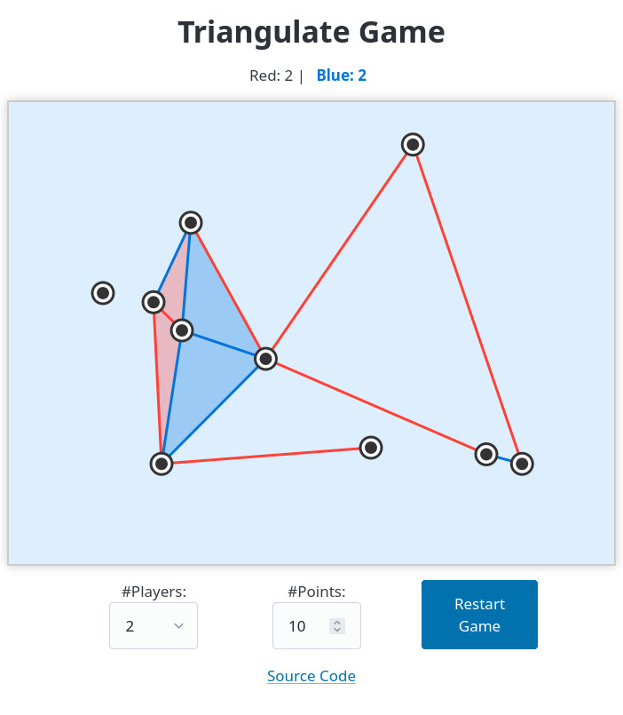

# Triangulate Game

**Triangulate Game** is a turn-based strategy game for 2 to 4 players, built with **React** and **HTML5 Canvas**.



## Game Objective

Players take turns connecting points.
When a triangle is completed, with all three sides drawn and no other point inside, it scores 1 point for that player.
The game ends when no more valid edges can be added.
The player with the highest score wins.

## Installation

```bash
git clone https://github.com/LaisRast/triangulate-game.git
cd triangulate-game
npm install
npm run dev
```

Then open your browser to [http://localhost:5173](http://localhost:5173).

## License

MIT License. See `LICENSE` for details.
